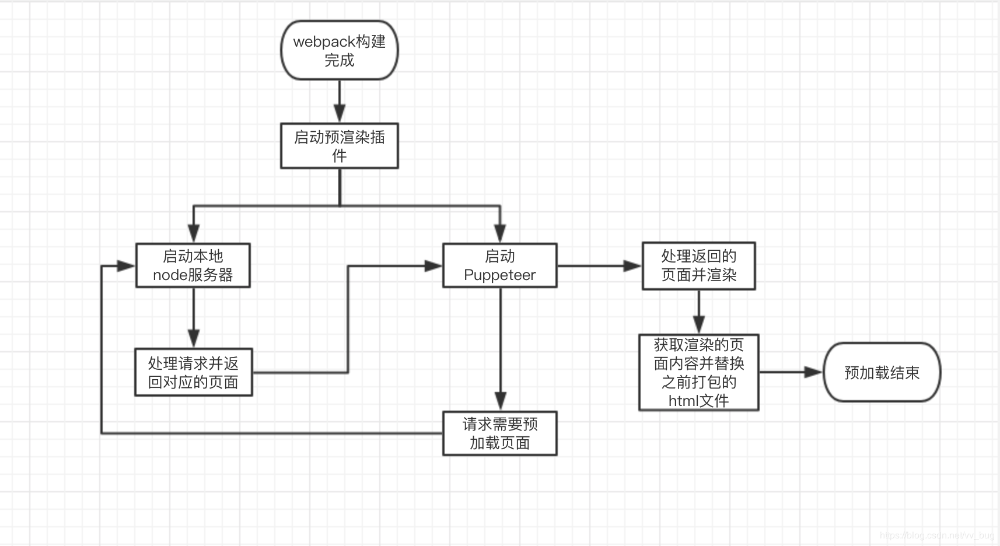

# 搭建一个自己的前端项目

项目相关

### 搭建脚手架

案例：[https://www.npmjs.com/package/create-fv-cli](https://www.npmjs.com/package/create-fv-cli)

脚手架重点：

1. 脚手架名称不能有冲突（可以在 npm 官网查询）
2. 脚手架入口 `package.json` -> `bin`
3. 脚手架如果名称为 `create-fv-cli` 那么 `npm init fv-cli` 可以指到 `create-fv-cli` 地址。
4. 脚手架的依赖包要放在 `dependencies` 中（否则会提示没有module）

脚手架的几种思路：

1. 最好的当然是 yyx 的利用 `fs-extra` 估计目录执行 `copy`
2. 也可以使用 commander 通过 git clone 安装


### PrerenderSPAPlugin 启动预渲染

预渲染采用 vue 推荐的 `PrerenderSPAPlugin` 插件，放入 `webpack` 就可以使用

PrerenderSPAPlugin 使用

```js
  new PrerenderSPAPlugin({
    staticDir: path.join(__dirname, 'dist'),
    routes: [ '/', '/about'],
    renderer: new PrerenderSPAPlugin.PuppeteerRenderer({
      renderAfterDocumentEvent: 'render-event',
      // renderAfterTime: 5000
    })
  })
```

在 vue 文件中通过 `renderAfterDocumentEvent` 告知 `PrerenderSPAPlugin` render 时间点，当然多个 route 需要弄多个 event

```js
  document.dispatchEvent(new Event('render-active'))
```

工作流程




### nuxt.js 搭建 ssr 或 预渲染

直接通过  官网就可以使用了。


###  微服务基础 single-spa

子项目：
* 在开发或者单独部署时，按照各自风格编写。
* 如果要集成微服务架构，需要再设置单独的打包方式，以引入`single-spa-vue`或者其他单页面插件的js文件作为入口。
* 需要打包为 `library`，target可以是umd或者其他方式。
```
  libraryTarget: 'umd',
	library: 'app1'
```

根项目：
* 引入`single-spa`
* 通过`spa.registerApplication`的方式，在遇到特定`href`时加载不同的打包子项目入口文件
* 在开发环境，通过代理来实现不同的遇到特定`href`代理不同的子项目。


### 阿里 qiankun 实现微服务

qiankun 是基于 single-spa 的微服务框架。实现了几乎包含所有构建微前端系统时所需要的基本能力，如 样式隔离、js 沙箱、预加载等。

使用 自带的 example

```
  $ git clone https://github.com/umijs/qiankun.git
  $ cd qiankun
  $ yarn install
  $ yarn examples:install
  $ yarn examples:start
```

使用 qiankun 可以无缝兼容已有的项目...真棒呢

