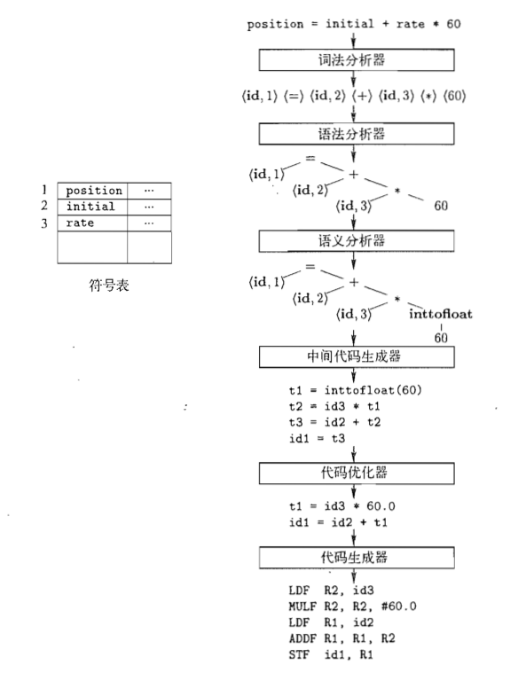
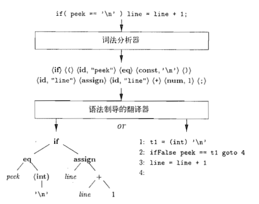
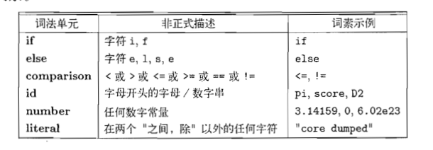
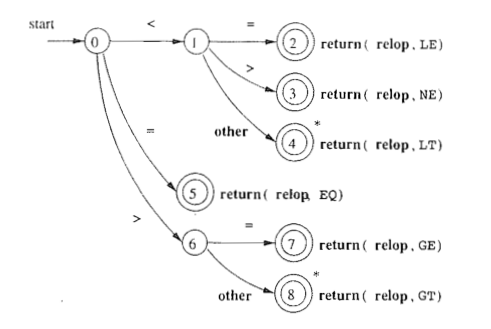

# 《编译原理》第二版

JavaScript是脚本语言：具有高层次运算符的解释型语言（JS、PHP、Python等）

### 可靠的程序

一个软件系统最重要的就是：快速、经济、可靠

类型检查是一种有效的，被充分研究的技术（成熟），它可以被用于捕捉程序中的不一致性，它可以用来检测一些错误（可靠）。

垃圾收集机制是：在`效率`和`易编程`及软件`可靠性`之间进行的`折中处理`的极好方式


### 名词解释

* 符号表：符号表是一种供编译器用于保存相关源程序构造的各种信息的数据结构。这些信息在编译器分析阶段被逐步收集并放入符号表，它们在综合阶段用于生成目标代码。
  * 保留字也保存在符号表中，在词法分析时使用
* 编译器和解释器：例如，Java源码 首先要被`编译器`编译成 字节码(bytecode) `.class` 文件，然后经过一个虚拟机（`解释器`）对字节码进行解释执行。
* 而在编译器之前：一个源程序可能被分割成多个模块，并存放在独立的文件中，把源程序聚合在一起的任务 **有时** 会由一个被称为`预处理器`的程序独立完成。


### 编译器的结构

1. 分析部分（编译器的前端）
   1. 把源码分解成多个组成要素
   2. 在组成要素的基础上加上语法结构
   3. 使用这个结构创建
   4. 会进行静态检查（语法检查、类型检查）
2. 综合部分（编译器的后端）
   1. 根据分析部分的`中间表示`和`符号表中的信息`来构造目标程序

### 编译器主要行为步骤

1. 词法分析 -> 符号流
   * 识别：关键字、标识符、操作符、字面量
   * 将程序分割成一个个 `Token` 的过程，（这里有`自动机`的概念）
2. 语法分析 -> 抽象语法树
   * 在词法分析的基础上识别出语法结构，形成 AST
3. 语义分析
   * 消除语义模糊，生成一些属性信息，让计算机能够依据这些信息生成目标代码。
4. 中间代码生成器 -> 中间表示形式
5. 机器无关代码优化器
6. 代码生成器 -> 目标机器语言
7. 机器相关代码优化器

详细步骤：




### 编译过程划分

编译器是一个自顶向下，逐行读取，深度优先的翻译过程，构造一个语法要从源语言的文法开始：

把编译过程的分析分析部分划分为词法分析和语法分析，原因
1. 最重要原因：简化编译器的设计
2. 提高编译器的效率
3. 增强编译器的可移植性


### 语法分析

1. 剔除空白和注释：
2. 预读：（比如遇到`>`那么就要预先读入一个字符，如果下一个字符是`=`，那么会组合成`>=`）
3. 常量：（比如：`31 + 28 + 59`会被转换为 `<num, 31> <+> <num, 28> <+> <num, 59>`）
4. 识别关键字和标识符（保留字 和 单一表示）


中间代码的两种形式：
1. 抽象语法树（`AST`）：用来表示源码的层次化语法结构，节点表示有意义的程序构造
2. 线性表示：“三地址”指令序列：显示更加完整的示例，由基本程序步骤（比如两个值相加）组成，最多只执行一个运算


上下文无关文法：一种描述程序设计语言语法的表示方法，由四要素组成
1. 一个终结符号集合
2. 一个非终结符号集合
3. 一个产生式符号集合
4. 指定一个非终结符号为开始符号

```
    // 一个 if-else 语句通常具有以下形式：
    if (expression) statement else statement
    // -> 构造规则可以表示为
    stmt -> if (expr) stmt else stmt
```

语法分析树：用图形的方式展示了从上下文无关文法的开始符号推导出相应语言中的符号串的过程。一个上下文无关文法可能有多颗语法分析树的终结符，这样的上下文无关文法具有二义性。 - -。

一个语句的两种可能翻译结果




### 词法分析

主要有3个相关部分
1. 词法单元：
2. 模式：
3. 词素：



加快源程序读入速度的方法：
1. 缓冲区对：两个交替读入的缓冲区
   1. lexemeBegin 指针：指向当前词素的开始处
   2. forward 指针：一直向前扫描，直到发现某个模式被匹配为止，指向词素的结尾
2. 哨兵标记：
   1. 每次 forward 指针移动的时候都需要去判断是否到了缓冲区的末尾，如果是，那么必须加载另一个缓冲区，因此，每读入一个字符就是要做2次测试，
   2. 如果我们扩展缓冲区（在末尾添加一个“哨兵”字符一般是eof），这样就可以把字符测试和缓冲区末端测试合二为一

作为构造词法分析器的一个中间步骤，我们首先将模式转换成具有特定风格的流图。成为“状态转换图”

词法单元的状态转换图




### 自动机

**正则表达式** 是一种描述词素模式的重要表示方法，虽然不能表达出所有可能的模式，但是可以有效的描述词法单元要用到的模式类型。

从正则表达式到自动机：自动机就是一个算法
* 有穷自动机（FA）：将程序变成词法分析器，识别的是正则语言
* 确定性有穷自动机（DFA）：自动机的每个状态都有对字母表中所有符号的转移。
* 非确定性有穷自动机（NFA）：自动机的状态对字母表中的每个符号可以有也可以没有转移，对一个符号甚至可以有多个转移。


### 作用域

作用域是非常重要的：因为在程序的不同部分，可能会出于不同的目的而多次声明相同的标识符。


   
### 第三章看完 （136页）

有点像看天书。明年再看

